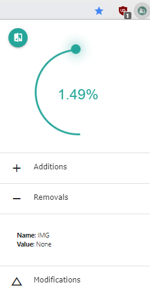

# DOM Explorer
Takes a diff of the DOM of visited pages and depicts the perctange in which the page has changed. 

 

**It is recommended to use the *waybackmachine-diff* branch as it is more versatile and can be used on non-bookmarked websites. However, it does not save data under the full URL and instead uses the main name of a webpage. This means that in order to get a true diff of changes made to a specific webpage, avoid comparing two different webpages of the same url, such as https://github.com/ and https://github.com/marketplace**
To use the wayback-machine branch, after cloning the repository, run `$ git checkout waybackmachine-diff`

## Build Webpack File
A webpack JS file needs to be built in order to run node modules in the browser extension.  
`$ npm run build`

## Operation Instructions
1. Run `npm install`
2. Run `npm run build`
3. Add the source folder to chrome://extensions in Chrome

- Optional to avoid warnings: run `$ rm node_modules/public-encrypt/test/*.pem` so as not to load key files in Google Chrome.

4. Navigate to a bookmarked webpage
5. Press the "DIFF" button inside the extension's pop-up
6. Manually change an element on the webpage or wait until you notice a change in your bookmarked website
7. Press the "DIFF" button again
8. View the client-side changes

## Viewing Results
If you would like to view the raw details of the results that were discussed in the COMP4905 report for DOM Explorer, please view the .pdf or .docx files in the /Results directory.

Note: All of the results are based on DOM Explorer version 2, which is based off the waybackmachine-diff branch.
